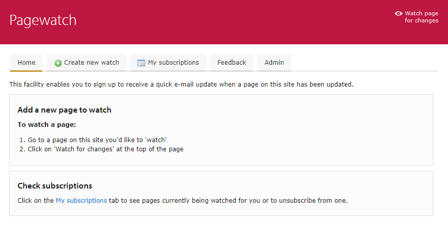

Pagewatch
=========

This is a PHP application which enables people to 'watch' pages on a website for changes and get e-mail alerts when a change happens.

Screenshot
----------

Usage
-----

1. Clone the repository.
2. Run `composer install` to install the dependencies.
3. Download and install the famfamfam icon set in /images/icons/
4. Add the Apache directives in httpd.conf (and restart the webserver) as per the example given in .httpd.conf.extract.txt; the example assumes mod_macro but this can be easily removed.
5. Create a copy of the index.html.template file as index.html, and fill in the parameters.
6. Set up a cron job, as per the supplied example, pointing to the index.html file.
7. Access the page in a browser at a URL which is served by the webserver.

Dependencies
------------

* [FamFamFam Silk Icons set](http://www.famfamfam.com/lab/icons/silk/)

Daily e-mails
-------------

Invoke using PHP from the command-line under cron - see `pagewatch.cron-example` as noted above.

If not possible, `wget` is a workaround:

`wget --quiet --delete-after --user-agent="Pagewatch" https://example.com/pagewatch/runcheck.html`

Database permissions
--------------------

MySQL needs:
`GRANT SELECT,INSERT,UPDATE,DELETE ON pagewatch.* TO pagewatch@servername;`

Author
------

Martin Lucas-Smith, Department of Geography, 2003-24.

License
-------

GPL3.

